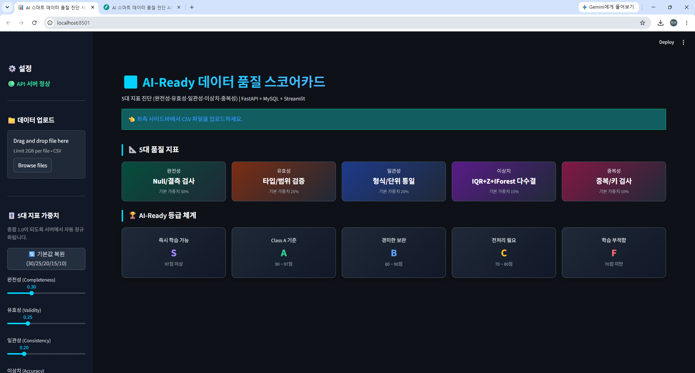
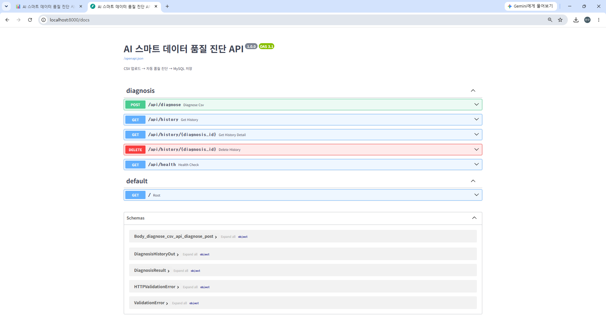

# 📊 AI-Ready 데이터 품질 진단 시스템

> CSV 데이터를 업로드하면 5대 데이터 품질 지표를 자동 분석하고 AI 학습 적합도를 평가하는 데이터 품질 진단 플랫폼

---

## 📌 프로젝트 소개

AI 모델의 성능은 데이터 품질에 크게 의존합니다.

본 프로젝트는 CSV 파일을 업로드하면 다음 5가지 품질 지표를 자동 분석하여 데이터의 AI 활용 가능성을 평가합니다.

- 완전성 (Completeness)
- 유효성 (Validity)
- 일관성 (Consistency)
- 이상치 (Accuracy)
- 중복성 (Uniqueness)

진단 결과는 MySQL 데이터베이스에 저장되며, 다양한 시각화 차트를 통해 데이터 품질 상태를 직관적으로 확인할 수 있습니다.

---

## 🏗 시스템 아키텍처

```text
┌─────────────┐
│  Streamlit  │
│  Frontend   │
└──────┬──────┘
       │ REST API
       ▼
┌─────────────┐
│   FastAPI   │
│  Backend    │
└──────┬──────┘
       │
       ▼
┌─────────────┐
│   MySQL     │
│ Diagnosis DB│
└─────────────┘
```

---

## 🚀 주요 기능

### 📁 CSV 업로드

- CSV 파일 업로드
- UTF-8 / CP949 자동 인코딩 처리
- 대용량 파일 지원

### 🎯 5대 데이터 품질 진단

| 품질 지표 | 설명 |
|-----------|------|
| 완전성 | Null 및 결측치 검사 |
| 유효성 | 데이터 타입 및 범위 검증 |
| 일관성 | 형식 및 단위 통일성 검사 |
| 이상치 | IQR + Z-Score + Isolation Forest |
| 중복성 | 중복 데이터 탐지 |

---

### 🏆 AI-Ready 등급 평가

| 등급 | 기준 |
|------|------|
| S | 97점 이상 |
| A | 90 ~ 97점 |
| B | 80 ~ 90점 |
| C | 70 ~ 80점 |
| F | 70점 미만 |

---

### 📊 데이터 시각화

- 5대 지표 레이더 차트
- 품질 점수 막대 그래프
- 컬럼별 결측률 분석
- 이상치 분석
- 데이터 품질 이력 추세 분석

---

## 📷 실행 화면

### 메인 대시보드



### FastAPI Swagger API 문서



---

## 🧠 품질 진단 알고리즘

### 1️⃣ 완전성 (Completeness)

```text
점수 = (1 - 결측 셀 수 / 전체 셀 수) × 100
```

### 2️⃣ 유효성 (Validity)

검사 항목

- 타입 불일치
- 범위 오류
- 무한대(inf) 값 검사

---

### 3️⃣ 일관성 (Consistency)

검사 항목

- 앞뒤 공백
- 대소문자 혼용
- 날짜 형식 불일치

---

### 4️⃣ 이상치 (Accuracy)

앙상블 기반 이상치 탐지

```text
IQR
+
Z-Score
+
Isolation Forest

→ 2개 이상 탐지 시 이상치 판정
```

---

### 5️⃣ 중복성 (Uniqueness)

```text
중복 행 탐지
```

---

## 🛠 기술 스택

### Frontend

- Streamlit
- Plotly

### Backend

- FastAPI
- Pydantic

### Database

- MySQL
- SQLAlchemy

### Data Analysis

- Pandas
- NumPy
- Scikit-Learn

### Visualization

- Plotly

---

## 📂 프로젝트 구조

```text
AI_Data_Quality/

├── frontend
│   ├── app.py
│   ├── utils
│   └── visualization
│
├── backend
│   ├── api
│   ├── db
│   ├── schemas
│   ├── services
│   └── main.py
│
├── init_db.sql
├── requirements.txt
└── README.md
```

---

## ⚙️ 설치 방법

### 1. 저장소 클론

```bash
git clone https://github.com/사용자명/레포지토리명.git
cd 레포지토리명
```

### 2. 패키지 설치

```bash
pip install -r requirements.txt
```

### 3. MySQL 데이터베이스 생성

```sql
source init_db.sql
```

### 4. FastAPI 서버 실행

```bash
uvicorn backend.main:app --reload --port 8000
```

Swagger 접속

```text
http://localhost:8000/docs
```

### 5. Streamlit 실행

```bash
streamlit run frontend/app.py
```

서비스 접속

```text
http://localhost:8501
```

---

## 📈 기대 효과

- AI 학습 전 데이터 품질 자동 진단
- 데이터 정제 우선순위 도출
- 데이터 품질 이력 관리
- AI 학습 가능 여부 사전 평가
- 데이터 기반 의사결정 지원

---

## 👨‍💻 팀 소개

| 이름 | 역할 |
|------|------|
| 이정일 | 프로젝트 멘토 및 지도 |
| 노건우 | 프로젝트 총괄 관리 및 서비스 기획, DSC 설계 |
| 양진희 | 프론트엔드 및 시각화 (Streamlit 화면 및 대시보드 구현) |
| 송현우 | 데이터 엔지니어링(Pandas 기반 전처리 분석), 인프라 및 QA |

---

## 📜 라이선스

본 프로젝트는 미래내일 일경험 프로그램 수행 프로젝트입니다.
